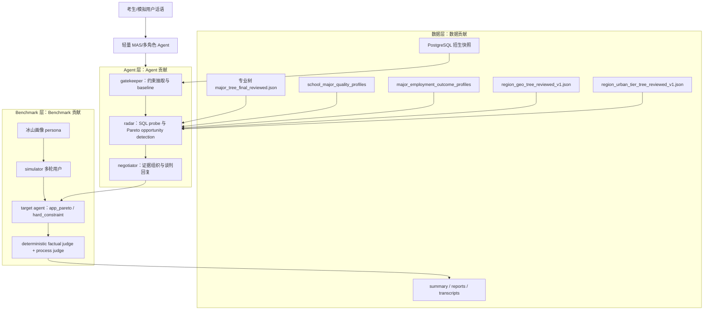
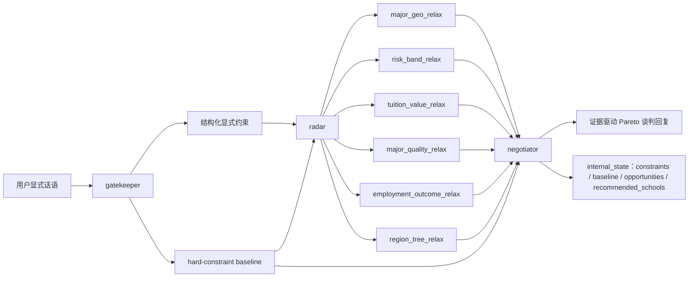
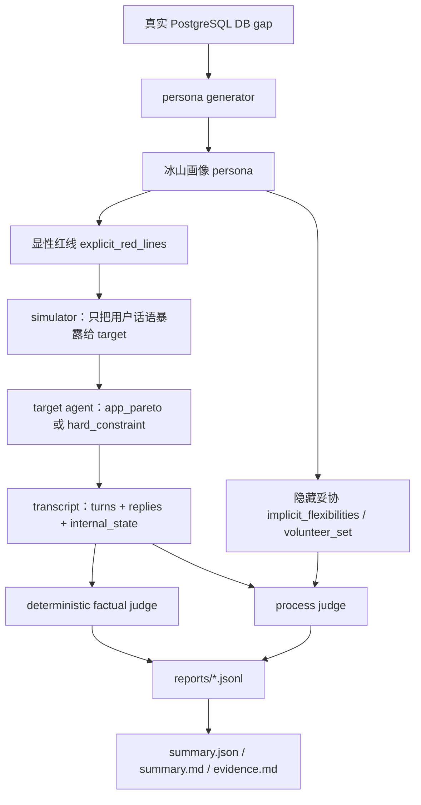
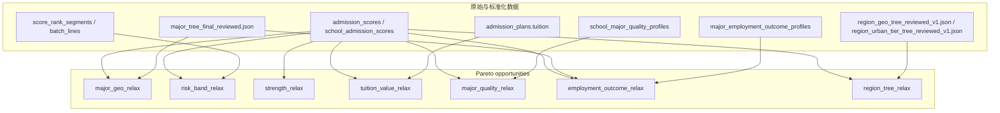

# 论文图表与算法表格素材包

本文档用于把当前“数据 + Agent + Benchmark”论文主线整理成可直接迁入毕业论文、答辩 PPT 或 LaTeX 绘图工具的图表和算法素材。它不新增实验结论，不替代 summary、reports、transcripts 或 evidence 附录；它的作用是把已经完成的七组 Agent-vs-Baseline 实验、轻量 MAS/多角色 Agent 架构和数据证据层转成更清晰的论文表达材料。

当前论文贡献结构为：

| 贡献线 | 核心对象 | 论文表达重点 |
| --- | --- | --- |
| 数据贡献 | PostgreSQL 招生快照、专业树、`school_major_quality_profiles`、`major_employment_outcome_profiles`、`region_geo_tree_reviewed_v1.json`、`region_urban_tier_tree_reviewed_v1.json` | 把分数、位次、学费、专业质量、就业结果和地域树节点转成可核验事实证据 |
| Agent 贡献 | `gatekeeper -> radar -> negotiator` 轻量 MAS/多角色 Agent | 用证据驱动 Pareto 谈判触发隐藏偏好妥协 |
| Benchmark 贡献 | 冰山画像、多轮沙盒、事实/过程联合评价、`app_pareto` vs `hard_constraint` | 用可复现实验验证 Agent 是否优于硬约束 baseline |

本文图表默认遵守两条边界：第一，`major_geo_v1 + risk_band_v1` 是主实验；第二，`school_strength_v1`、`tuition_value_v1`、`major_quality_v1`、`employment_outcome_v1`、`region_tree_v1` 是扩展实验，用于支撑数据贡献和框架可扩展性。

此外，`multi_axis_v1` 作为 Benchmark 压力测试单独呈现，用于评估两个隐藏放宽轴同时存在时的证据编排能力。它不进入七组实验结果总表，也不替代主实验。

## 0. 可用图像资产

当前首选的论文/PPT 图像资产已经由 Diagrams 生成，位置为 `gaokaollm_bench/outputs/thesis_figures/`，作图环境、渲染命令和图号说明见 `gaokaollm_bench/outputs/thesis_diagrams_with_diagrams.md`。这些 SVG/PNG 是正式成稿优先使用的图像素材；本文后续 Mermaid 图继续保留为概念草稿、结构说明和后续重绘参考。

| 图号 | 中文图题 | 优先图像资产 |
| --- | --- | --- |
| 图 4-1 | 数据 + Agent + Benchmark 总体架构图 | `thesis_figures/fig_4_1_system_architecture.svg` / `.png` |
| 图 5-1 | 轻量 MAS/多角色 Agent 工作流图 | `thesis_figures/fig_5_1_mas_workflow.svg` / `.png` |
| 图 4-2 | Benchmark 多轮评测流程图 | `thesis_figures/fig_4_2_benchmark_flow.svg` / `.png` |
| 图 4-3 | 数据证据层与 relax 能力映射图 | `thesis_figures/fig_4_3_data_evidence_relax_mapping.svg` / `.png` |

## 1. 图表清单

| 编号 | 图表名称 | 建议放置章节 | 作用 |
| --- | --- | --- | --- |
| 图 4-1 | 数据 + Agent + Benchmark 总体架构图 | 第 4 章或第 5 章开头 | 展示数据层、Agent 层、Benchmark 层和论文产物层之间的关系 |
| 图 5-1 | 轻量 MAS/多角色 Agent 工作流图 | 第 5 章 Agent 方法 | 解释 `gatekeeper -> radar -> negotiator` 的角色分工 |
| 图 4-2 | Benchmark 多轮评测流程图 | 第 4 章 Benchmark 方法 | 说明冰山画像、simulator、target agent、evaluator 和产物的闭环 |
| 图 4-3 | 数据证据层与 relax 能力映射图 | 第 4 章数据层设计 | 说明招生事实、学费、专业质量、就业结果、地域树如何支撑各类 Pareto 机会 |
| 表 6-1 | 七组实验结果总表 | 第 6 章实验结果 | 汇总主实验与扩展实验的核心指标 |
| 表 5-1 | 算法到实验映射表 | 第 5 章或第 6 章 | 把算法、数据证据、实验结果和论文意义对应起来 |
| 表 6-3 | `multi_axis_v1` Benchmark 压力测试表 | 第 6 章补充实验或附录 | 展示多轴隐藏妥协的三类 profile、聚合指标和证据编排瓶颈 |

## 2. 系统总体架构图



论文说明建议：

| 层次 | 图中节点 | 可写入论文的解释 |
| --- | --- | --- |
| 数据层 | PostgreSQL、专业树、专业质量、就业结果、地域树 reviewed v1 | 提供可查询、可审计的事实证据，不依赖模型臆测 |
| Agent 层 | `gatekeeper -> radar -> negotiator` | 通过角色分工完成约束抽取、机会探测和证据谈判 |
| Benchmark 层 | persona、simulator、target agent、evaluator | 用冰山画像和多轮沙盒评测是否触发隐藏妥协 |
| 产物层 | summary、reports、transcripts | 支撑论文结果复现和逐例追溯 |

## 3. 轻量 MAS/多角色 Agent 工作流图



MAS 口径建议写法：

| 角色 | 定位 | 主要输入 | 主要输出 |
| --- | --- | --- | --- |
| `gatekeeper` | 约束抽取与 baseline agent | 用户显式话语 | 分数、省份、专业、选科、预算、风险偏好等显式约束，以及当前硬约束 baseline |
| `radar` | 机会探测 agent | 显式约束与 baseline | 多类 Pareto opportunities 与候选证据 |
| `negotiator` | 证据组织与谈判 agent | baseline、opportunities、候选证据 | 面向用户的解释性回复和可审计 `internal_state` |

边界说明：本文中的 MAS 是“基于角色分工的轻量 MAS/多角色 Agent 架构”，不是完全自治的多智能体系统。Benchmark 侧的 simulator 与 evaluator 可以称为 agent-like role，但不属于被测业务 Agent 的内部能力。

## 4. Benchmark 多轮评测流程图



论文说明建议：

| Benchmark 环节 | 目的 | 防止的问题 |
| --- | --- | --- |
| 真实 DB gap | 从真实招生数据中构造 baseline 与 relaxed set | 避免人工编造学校、专业、分数和收益 |
| 冰山画像 | 区分用户说出口的红线和隐藏可妥协条件 | 避免把显性偏好误认为真实不可变约束 |
| 多轮沙盒 | 让 Agent 通过对话触发妥协 | 避免只评价单轮问答 |
| 事实裁判 | 检查学校、专业、分数、位次、学费、质量和就业证据 | 控制幻觉 |
| 过程裁判 | 判断是否命中隐藏妥协并产生 Pareto gain | 衡量谈判是否真正有效 |

Agent 不读取 `implicit_flexibilities` 或 `volunteer_set`。这些字段只作为 evaluator ground truth，不能进入 `app_pareto` 的输入。

## 5. 数据证据层与 Relax 能力映射图



可迁入论文的解释表：

| 数据证据层 | 支撑的 relax | 输出到 transcript 的证据 |
| --- | --- | --- |
| `admission_scores`、`school_admission_scores` | 所有 relax | 学校、专业、最低分、最低位次、年份 |
| `score_rank_segments`、`batch_lines` | `risk_band_relax` | `score_margin`、`rank_gap`、风险层级 |
| `admission_plans.tuition` | `tuition_value_relax` | 学费、学费增量、预算窗口 |
| 专业树 | `major_geo_relax`、`employment_outcome_relax` | 同专业、相近专业、专业类或更宽专业集合 |
| `school_major_quality_profiles` | `major_quality_relax` | `quality_score`、`quality_gain`、专业排名/学科评估/特色/重点/满意度证据 |
| `major_employment_outcome_profiles` | `employment_outcome_relax` | `outcome_score`、`outcome_gain`、就业排名、行业、岗位、薪资证据 |
| `region_geo_tree_reviewed_v1.json`、`region_urban_tier_tree_reviewed_v1.json` | `region_tree_relax` | `geo_block_relax`、`urban_tier_relax`、源/目标地域节点、树置信度 |

## 6. 通用算法伪代码

### 6.1 Pareto Opportunity Detection

```text
Algorithm 1: Evidence-driven Pareto opportunity detection

Input:
  user_utterances
  PostgreSQL evidence tables
  supported_relax_types

Output:
  reply
  internal_state

Steps:
  1. gatekeeper extracts explicit constraints from user_utterances.
  2. gatekeeper queries hard-constraint baseline under explicit constraints.
  3. radar enumerates supported_relax_types.
  4. for each relax_type:
       a. keep hard constraints such as score, selected_subjects and eligibility.
       b. relax only the target negotiable preference.
       c. query PostgreSQL evidence tables.
       d. filter candidates by factual validity and quality rules.
       e. rank candidates by Pareto gain and evidence strength.
  5. negotiator compares baseline with Pareto opportunities.
  6. negotiator produces a reply grounded in candidate evidence.
  7. return reply and internal_state with constraints, baseline, opportunities and recommended_schools.
```

### 6.2 Hidden Persona 边界

```text
Algorithm 2: Benchmark leakage boundary

Input visible to app_pareto:
  user utterances
  PostgreSQL query results

Input hidden from app_pareto:
  implicit_flexibilities
  volunteer_set

Evaluator-only usage:
  implicit_flexibilities defines hidden compromise conditions.
  volunteer_set defines accepted target candidates.
  judge checks whether transcript evidence triggers the hidden condition.
```

## 7. 具体 Relax 算法素材

### 7.1 `major_geo_relax`

```text
Algorithm 3: major_geo_relax

Keep:
  score, selected_subjects, budget and factual eligibility

Relax:
  province constraint
  original major constraint

Evidence:
  major tree stage, school, province, major, min_score, min_rank, tier/ranking

Procedure:
  1. Query baseline under original province and major.
  2. Remove province restriction.
  3. Relax major by staged professional tree search.
  4. Prefer candidates with valid admission evidence and higher school level.
  5. Return candidates as joint major + geography Pareto opportunities.
```

### 7.2 `risk_band_relax`

```text
Algorithm 4: risk_band_relax

Keep:
  score, province, major, selected_subjects, budget

Relax:
  conservative risk preference such as "only safe choices"

Evidence:
  min_score, min_rank, score_margin, rank_gap, chong/wen/bao risk band

Procedure:
  1. Query reachable candidates under hard constraints.
  2. Compute score_margin = student_score - min_score.
  3. Compute rank_gap when student_rank and min_rank are available.
  4. Assign risk band by rank_gap first, score_margin fallback second.
  5. Build a chong/wen/bao portfolio instead of a single conservative set.
```

### 7.3 `tuition_value_relax`

```text
Algorithm 5: tuition_value_relax

Keep:
  score, major, selected_subjects and eligibility

Relax:
  tuition budget upper bound

Window:
  budget < tuition <= budget + 10000

Evidence:
  tuition, tuition_delta, min_score, min_rank, tier/ranking improvement

Procedure:
  1. Query baseline candidates within budget.
  2. Query candidates with tuition above budget but within the fixed window.
  3. Keep candidates that remain reachable under score and subject constraints.
  4. Rank by value gain from school level, ranking or quality evidence.
```

### 7.4 `major_quality_relax`

```text
Algorithm 6: major_quality_relax

Keep:
  score, selected_subjects, budget and major intent

Relax:
  school choice or geography when professional quality evidence improves

Evidence:
  quality_score, quality_gain, best_major_rank, best_rating, featured/key major, satisfaction

Procedure:
  1. Join reachable admission candidates with school_major_quality_profiles.
  2. Compare candidate quality_score against baseline professional quality.
  3. Keep candidates with positive quality_gain and valid admission evidence.
  4. Surface evidence_sources so the reply can cite concrete quality signals.
```

### 7.5 `employment_outcome_relax`

```text
Algorithm 7: employment_outcome_relax

Keep:
  score, selected_subjects, budget and factual eligibility

Relax:
  nearby major or geography when employment evidence improves

Evidence:
  outcome_score, outcome_gain, employment_rank, top_industry, job_distribution, salary_distribution

Procedure:
  1. Use major tree to find same-major or near-major candidates.
  2. Join candidates with major_employment_outcome_profiles.
  3. Compute outcome_gain against baseline employment evidence.
  4. Keep candidates with valid score evidence and stronger employment outcome.
  5. Return candidates with industry, job and salary evidence.
```

### 7.6 `region_tree_relax`

```text
Algorithm 8: region_tree_relax

Keep:
  score, major, selected_subjects, budget and factual eligibility

Relax:
  geography preference through reviewed region-tree nodes

Evidence:
  source_region_node, target_region_node, geo_block_relax, urban_tier_relax,
  tree_confidence, school, city, province, min_score, min_rank, tier/ranking

Procedure:
  1. Map the explicit province/city preference to reviewed region-tree nodes.
  2. For geo_block_relax, expand to adjacent or same-block geography nodes.
  3. For urban_tier_relax, expand to reviewed city-tier nodes when the user asks for a better city.
  4. Query reachable candidates under score, major, subject and budget constraints.
  5. Return candidates with region-tree evidence and admission facts.

Boundary:
  City tier is reviewed region-tree evidence only.
  It is not treated as direct evidence of employment opportunity, living cost or city quality.
  region_tree_v1 Pareto gain is still computed from school tier/ranking improvement.
```

## 8. 算法到实验映射表

斜杠格式依次为 `elicitation_success_rate / mean_pareto_gain / mean_hallucination_rate / avg_turns`。

| 实验 | 类型 | 核心算法 | 关键数据证据 | `app_pareto` | `hard_constraint` | 论文意义 |
| --- | --- | --- | --- | --- | --- | --- |
| `major_geo_v1` | 主实验 | `major_geo_relax` | 专业树、最低分、最低位次、学校层次 | `0.900 / 0.900 / 0.000 / 5.20` | `0.000 / 0.000 / 0.000 / 7.00` | 证明专业+地域联合放宽可触发隐藏妥协 |
| `risk_band_v1` | 主实验 | `risk_band_relax` | `score_margin`、`rank_gap`、`chong/wen/bao` 风险层级 | `1.000 / 3.000 / 0.000 / 5.00` | `0.000 / 0.000 / 0.000 / 15.00` | 证明志愿组合质量也是 Pareto gain |
| `school_strength_v1` | 扩展实验 | `strength_relax` | 学校或学科实力、排名、评级 | `1.000 / 15.000 / 0.000 / 5.00` | `0.000 / 0.000 / 0.000 / 11.00` | 证明实力证据可以接入同一谈判框架 |
| `tuition_value_v1` | 扩展实验 | `tuition_value_relax` | `admission_plans.tuition`、学费增量、最低分 | `1.000 / 1.000 / 0.000 / 5.00` | `0.000 / 0.000 / 0.000 / 11.00` | 证明预算边界可通过性价比证据被校准 |
| `major_quality_v1` | 扩展实验 | `major_quality_relax` | `school_major_quality_profiles`、`quality_score`、质量证据 | `1.000 / 16.000 / 0.000 / 5.00` | `0.000 / 0.000 / 0.050 / 11.00` | 证明专业质量标准化层能支撑更细粒度妥协 |
| `employment_outcome_v1` | 扩展实验 | `employment_outcome_relax` | `major_employment_outcome_profiles`、`outcome_score`、就业证据 | `1.000 / 49.000 / 0.000 / 3.00` | `0.000 / 0.000 / 0.000 / 11.00` | 证明就业结果证据可扩展到同一闭环 |
| `region_tree_v1` | 扩展实验 | `region_tree_relax` | `region_geo_tree_reviewed_v1.json`、`region_urban_tier_tree_reviewed_v1.json`、地域树节点 | `1.000 / 1.000 / 0.000 / 3.00` | `0.000 / 0.000 / 0.000 / 11.00` | 证明 reviewed 地域树可扩展到同一闭环 |

## 9. 七组实验结果总表

| 实验组 | `app_pareto` 成功率 | `app_pareto` 平均 Pareto gain | `app_pareto` 幻觉率 | `app_pareto` 平均轮次 | baseline 成功率 | baseline 平均 Pareto gain | baseline 幻觉率 | baseline 平均轮次 |
| --- | ---: | ---: | ---: | ---: | ---: | ---: | ---: | ---: |
| `major_geo_v1` | `0.900` | `0.900` | `0.000` | `5.20` | `0.000` | `0.000` | `0.000` | `7.00` |
| `risk_band_v1` | `1.000` | `3.000` | `0.000` | `5.00` | `0.000` | `0.000` | `0.000` | `15.00` |
| `school_strength_v1` | `1.000` | `15.000` | `0.000` | `5.00` | `0.000` | `0.000` | `0.000` | `11.00` |
| `tuition_value_v1` | `1.000` | `1.000` | `0.000` | `5.00` | `0.000` | `0.000` | `0.000` | `11.00` |
| `major_quality_v1` | `1.000` | `16.000` | `0.000` | `5.00` | `0.000` | `0.000` | `0.050` | `11.00` |
| `employment_outcome_v1` | `1.000` | `49.000` | `0.000` | `3.00` | `0.000` | `0.000` | `0.000` | `11.00` |
| `region_tree_v1` | `1.000` | `1.000` | `0.000` | `3.00` | `0.000` | `0.000` | `0.000` | `11.00` |

论文写法建议：主实验表可以只展示 `major_geo_v1` 与 `risk_band_v1`，扩展实验表展示其余五组。答辩 PPT 可以合并成上表，用颜色区分主实验和扩展实验。

## 9.1 Benchmark 压力测试结果表

`multi_axis_v1` 不改变七组实验事实口径，而是单独作为 Benchmark 压力测试，检验 `app_pareto` 在两个隐藏放宽轴同时成立时能否组织多类证据。斜杠格式仍为 `elicitation_success_rate / mean_pareto_gain / mean_hallucination_rate / avg_turns`。

| 压力测试 | `app_pareto` | `hard_constraint` | profile 成功分布 | 论文解释 |
| --- | --- | --- | --- | --- |
| `multi_axis_v1` | `0.533 / 1.133 / 0.029 / 7.67` | `0.000 / 0.000 / 0.000 / 13.00` | `major_geo_risk` 1/10；`quality_tuition` 5/10；`employment_region` 10/10 | 多轴 benchmark 能暴露单轴实验看不出的证据编排瓶颈，尤其 `major_geo_relax + risk_band_relax` 组合较难 |

该测试只组合已有 relax 能力，不新增新的业务放宽算法。Agent 不读取 `implicit_flexibilities`、`volunteer_set` 或 `axis_flexibilities`；这些字段只用于 simulator/evaluator。

## 10. 可直接迁入论文的边界说明

| 边界 | 推荐表述 |
| --- | --- |
| MAS 口径 | 本文采用基于角色分工的轻量 MAS/多角色 Agent 架构，而不是完全自治的多智能体系统。 |
| Hidden persona | Agent 不读取 `implicit_flexibilities` 或 `volunteer_set`，这些字段只用于 simulator 和 evaluator。 |
| 主实验定位 | `major_geo_v1 + risk_band_v1` 是论文第一版主实验，验证核心偏好妥协能力。 |
| 扩展实验定位 | 五组扩展实验支撑数据贡献和框架可扩展性，不替代主实验。 |
| 压力测试定位 | `multi_axis_v1` 是 Benchmark 压力测试，用于评估两个隐藏放宽轴同时成立时的证据编排能力，不进入七组实验主线。 |
| 数据证据边界 | 只有能落到 PostgreSQL 或标准化证据层的因素，才适合进入当前 Benchmark 闭环。 |
| 未实现方向 | 城市生活质量、家庭距离、校园文化、个人兴趣匹配等暂缺可核验证据，写作后续工作。 |

## 11. 论文使用建议

| 使用场景 | 推荐素材 |
| --- | --- |
| 绪论贡献概述 | 第 1 节贡献表、第 8 节算法到实验映射表 |
| 方法章节 | 第 2、3、4、5 节 Mermaid 图 |
| 算法章节 | 第 6、7 节伪代码 |
| 实验章节 | 第 8、9 节结果表 |
| 答辩 PPT | 系统总体架构图、MAS 工作流图、七组实验结果总表、`multi_axis_v1` 压力测试补充表 |

如果迁入 LaTeX，优先使用 `thesis_figures/` 下的 Diagrams SVG/PNG；Mermaid 图仅作为可编辑草稿和结构备份，必要时再用 TikZ、draw.io 或 PPT 重画。表格可直接转成三线表。正文中建议优先突出“数据证据驱动”的主线：数据层不是附属材料，而是 Agent 能够安全谈判、Benchmark 能够判定成功的基础。
