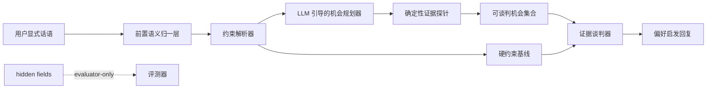
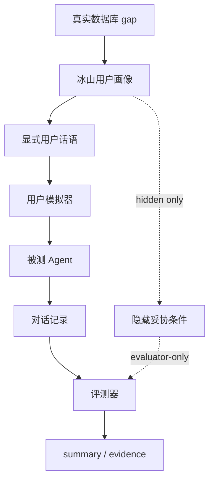

# 论文图表与算法表格素材包

本文档把当前“数据 + Agent + Benchmark”论文主线整理成可迁入毕业论文、答辩 PPT 或 LaTeX 绘图工具的图表和算法素材。它不新增实验结论，不替代 summary、reports、transcripts 或 evidence 附录；它的作用是把已经完成的七组 Agent-vs-Baseline 实验、轻量 MAS 架构、专业树/地域树等数据证据层，转成更清晰的论文表达材料。

## 0. 当前优先图像资产

当前首选的论文/PPT 图像资产由手工 SVG/PNG 论文框图生成器生成，位置为 `gaokaollm_bench/outputs/thesis_figures/`。作图环境、渲染命令和图号说明见 `gaokaollm_bench/outputs/thesis_diagrams_with_diagrams.md`；PDF 版式验收见 `gaokaollm_bench/outputs/thesis_figure_visual_acceptance.md`。

这些 SVG/PNG 是正式成稿优先使用的图像素材；本文档后续 Mermaid 只作为概念草稿和结构备份。

| 图号 | 中文图题 | 优先图像资产 | 建议章节 |
| --- | --- | --- | --- |
| 图 4-1 | 数据 + Agent + Benchmark 总体架构图 | `thesis_figures/fig_4_1_system_architecture.svg` / `.png` | 第 4 或第 5 章开头 |
| 图 5-1 | 轻量 MAS 工作流图 | `thesis_figures/fig_5_1_mas_workflow.svg` / `.png` | 第 5 章 |
| 图 4-2 | Benchmark 多轮评测流程图 | `thesis_figures/fig_4_2_benchmark_flow.svg` / `.png` | 第 4 章 |
| 图 4-3 | 数据证据层与放宽能力映射图 | `thesis_figures/fig_4_3_data_evidence_relax_mapping.svg` / `.png` | 第 4 章 |

新版图的 Agent 主路径为“前置语义归一层 -> 约束解析器 -> LLM 引导的机会规划器 -> 确定性证据探针 -> 证据谈判器”。实现层名称 `gatekeeper`、`radar`、`negotiator` 可在括注、附录或代码说明中保留，但不作为正文和图题的主叙述。

## 1. 论文贡献结构

| 贡献层 | 核心对象 | 论文表达重点 |
| --- | --- | --- |
| 数据贡献 | PostgreSQL 招生快照、专业层级本体、学校-专业质量画像、专业就业结果画像、经人工审校的地域层级画像 | 把分数、位次、学费、专业质量、就业结果和地域节点转成可核验事实证据 |
| Agent 贡献 | 前置语义归一层、约束解析器、LLM 引导的机会规划器、确定性证据探针、证据谈判器 | LLM 负责归一、规划、排序和澄清；事实候选只由确定性证据探针返回 |
| Benchmark 贡献 | 冰山画像、多轮沙盒、事实/过程联合评价、证据谈判 Agent vs 硬约束基线 | 用可复现实验验证 Agent 是否能触发隐藏妥协空间 |

边界说明：业务 Agent 不读取 `implicit_flexibilities`、`volunteer_set` 或 `axis_flexibilities`；这些字段只用于 simulator/evaluator。LLM 不生成学校、专业、分数或位次等事实候选。

## 2. 图表清单

| 编号 | 图表名称 | 建议章节 | 作用 |
| --- | --- | --- | --- |
| 图 4-1 | 数据 + Agent + Benchmark 总体架构图 | 第 4 或第 5 章开头 | 展示数据层、业务 Agent、Benchmark 和论文产物之间的闭环关系 |
| 图 5-1 | 轻量 MAS 工作流图 | 第 5 章 Agent 方法 | 解释语义归一、约束解析、LLM 规划、确定性探针与证据谈判的分工 |
| 图 4-2 | Benchmark 多轮评测流程图 | 第 4 章 Benchmark 方法 | 说明显式用户话语和评测端隐藏偏好的隔离方式 |
| 图 4-3 | 数据证据层与放宽能力映射图 | 第 4 章数据层设计 | 说明不同证据族如何支撑可谈判偏好轴 |
| 表 5-1 | 算法到实验映射表 | 第 5 或第 6 章 | 把算法、证据、实验结果和论文意义对应起来 |
| 表 6-1 | 七组实验结果总表 | 第 6 章 | 汇总主实验与扩展实验的核心指标 |
| 表 6-2 | 多轴压力测试对照表 | 第 6 章补充实验 | 展示多维隐藏妥协下的异质证据编排瓶颈 |

## 3. 推荐 Mermaid 草稿

Mermaid 仅作为概念草稿；正式论文优先使用 `thesis_figures/` 下的 SVG/PNG。

### 3.1 新 MAS 工作流草稿



### 3.2 Benchmark 流程草稿



## 4. 通用算法伪代码

### 4.1 证据驱动的偏好启发流程

```text
Algorithm 1: Evidence-driven preference elicitation

Input:
  visible user utterances
  PostgreSQL and standardized evidence tables
  supported negotiable preference axes

Output:
  user-facing reply
  auditable internal state

Steps:
  1. Normalize visible user utterances and decompose preference axes.
  2. Parse explicit hard constraints and query the hard-constraint baseline.
  3. Ask the LLM-guided planner to rank possible probe axes and emit clarification hints.
  4. Run deterministic evidence probes for selected axes.
  5. Filter candidates by score, subject, budget and factual eligibility.
  6. Rank opportunities by Pareto gain and evidence strength.
  7. Generate an evidence-grounded negotiation response.
  8. Return reply and auditable state.

Boundary:
  The LLM may plan, rank and ask for clarification.
  It may not generate factual candidate schools, scores or ranks.
```

### 4.2 Benchmark 泄漏边界

```text
Algorithm 2: Benchmark leakage boundary

Visible to the target Agent:
  user utterances
  deterministic evidence probe results

Hidden from the target Agent:
  implicit_flexibilities
  volunteer_set
  axis_flexibilities

Evaluator-only usage:
  hidden fields define accepted compromise conditions.
  the judge checks whether transcript evidence triggers those conditions.
```

## 5. 具体放宽算法素材

| 偏好轴 | 论文术语 | 关键证据 | 说明 |
| --- | --- | --- | --- |
| 专业-地域 | 分阶段专业-地域联合放宽 | 专业层级本体、最低分、最低位次、学校层次 | 从同叶子/近邻专业到更宽专业类，结合跨省候选 |
| 风险组合 | 冲稳保风险组合放宽 | 分差、位次差、风险层级 | 把“只求稳”转为组合质量的可谈判问题 |
| 学费预算 | 预算性价比放宽 | 学费、学费增量、学校层次收益 | 小幅超预算换取更好的学校或专业证据 |
| 专业质量 | 专业质量证据放宽 | 排名、评估、特色、满意度、质量得分 | 同专业或近邻专业中寻找更强专业质量 |
| 就业结果 | 就业导向放宽 | 就业排名、行业、岗位、薪资、结果得分 | 以就业结果证据触发专业或地域妥协 |
| 地域层级 | 地域层级偏好显性化 | 地理板块、城市层级、树置信度 | 仅作为偏好显性化证据，不直接等价于城市收益 |

## 6. 算法到实验映射表

斜杠格式为 `elicitation_success_rate / mean_pareto_gain / mean_hallucination_rate / avg_turns`。

| 实验 | 类型 | 核心算法 | `app_pareto` | `hard_constraint` | 论文意义 |
| --- | --- | --- | --- | --- | --- |
| `major_geo_v1` | 主实验 | 专业-地域联合放宽 | `0.900 / 0.900 / 0.000 / 5.20` | `0.000 / 0.000 / 0.000 / 7.00` | 验证专业与地域轴的隐藏妥协触发 |
| `risk_band_v1` | 主实验 | 风险组合放宽 | `1.000 / 3.000 / 0.000 / 5.00` | `0.000 / 0.000 / 0.000 / 15.00` | 验证组合风险结构也可形成 Pareto gain |
| `school_strength_v1` | 扩展实验 | 学校/学科实力证据放宽 | `1.000 / 15.000 / 0.000 / 5.00` | `0.000 / 0.000 / 0.000 / 11.00` | 验证实力证据可接入同一谈判框架 |
| `tuition_value_v1` | 扩展实验 | 预算性价比放宽 | `1.000 / 1.000 / 0.000 / 5.00` | `0.000 / 0.000 / 0.000 / 11.00` | 验证预算边界可通过成本收益证据校准 |
| `major_quality_v1` | 扩展实验 | 专业质量放宽 | `1.000 / 16.000 / 0.000 / 5.00` | `0.000 / 0.000 / 0.050 / 11.00` | 验证专业质量画像支持细粒度妥协 |
| `employment_outcome_v1` | 扩展实验 | 就业导向放宽 | `1.000 / 49.000 / 0.000 / 3.00` | `0.000 / 0.000 / 0.000 / 11.00` | 验证就业结果证据可扩展到同一闭环 |
| `region_tree_v1` | 扩展实验 | 地域层级放宽 | `1.000 / 1.000 / 0.000 / 3.00` | `0.000 / 0.000 / 0.000 / 11.00` | 验证地域层级画像可进入 Agent+Benchmark 闭环 |

## 7. Benchmark 压力测试表

`multi_axis_v1` 和 `multi_axis_v2` 是 Benchmark 压力测试，不进入七组实验主表，也不替代主实验。

| 压力测试 | `app_pareto` | `hard_constraint` | profile 成功分布 | 论文解释 |
| --- | --- | --- | --- | --- |
| `multi_axis_v1` | `0.533 / 1.133 / 0.029 / 7.67` | `0.000 / 0.000 / 0.000 / 13.00` | `major_geo_risk` 1/10, `quality_tuition` 5/10, `employment_region` 10/10 | 历史版本暴露了多轴画像构造一致性不足与证据编排瓶颈 |
| `multi_axis_v2` | `0.367 / 1.133 / 0.005 / 9.33` | `0.000 / 0.000 / 0.008 / 13.00` | `major_geo_risk` 6/10, `quality_tuition` 5/10, `employment_region` 0/10 | 轴一致性修正版更清楚地暴露就业证据与地域层级证据的联合编排瓶颈 |

## 8. 可直接迁入论文的边界说明

| 边界 | 推荐表述 |
| --- | --- |
| MAS 口径 | 本文采用基于角色分工的轻量 MAS，不夸大为完全自治多智能体系统。 |
| LLM 参与边界 | LLM 负责语义归一、机会规划、排序和澄清提示；事实候选由确定性证据探针生成。 |
| hidden persona | Agent 不读取 `implicit_flexibilities`、`volunteer_set` 或 `axis_flexibilities`。 |
| 主实验定位 | `major_geo_v1 + risk_band_v1` 是论文第一版主实验，验证核心偏好妥协能力。 |
| 扩展实验定位 | 五组扩展实验支撑数据贡献和框架可扩展性，不替代主实验。 |
| 压力测试定位 | 多轴压力测试用于暴露异质证据编排挑战，不作为第八组主线实验。 |
| 地域层级边界 | 城市层级只作为偏好显性化和地域树证据，不直接等价于就业机会、生活成本或生活质量收益。 |

## 9. 使用建议

| 使用场景 | 推荐素材 |
| --- | --- |
| 绪论贡献概述 | 第 1 节贡献表、第 6 节算法到实验映射表 |
| 方法章节 | `thesis_figures/` 四张手工 SVG/PNG 论文框图和第 4 节伪代码 |
| 实验章节 | 第 6 节七组实验结果表、第 7 节压力测试表 |
| 答辩 PPT | 总体架构图、MAS 工作流图、七组实验结果表、多轴压力测试表 |

迁入 LaTeX 时优先使用 `thesis_figures/` 下的手工 SVG/PNG 论文框图；Mermaid 图只作为可编辑草稿和结构备份，Diagrams 只保留为早期探索口径。表格可直接转成三线表。正文中建议优先突出“数据证据驱动”的主线：数据层不是附属材料，而是 Agent 能够安全谈判、Benchmark 能够判定成功的基础。
