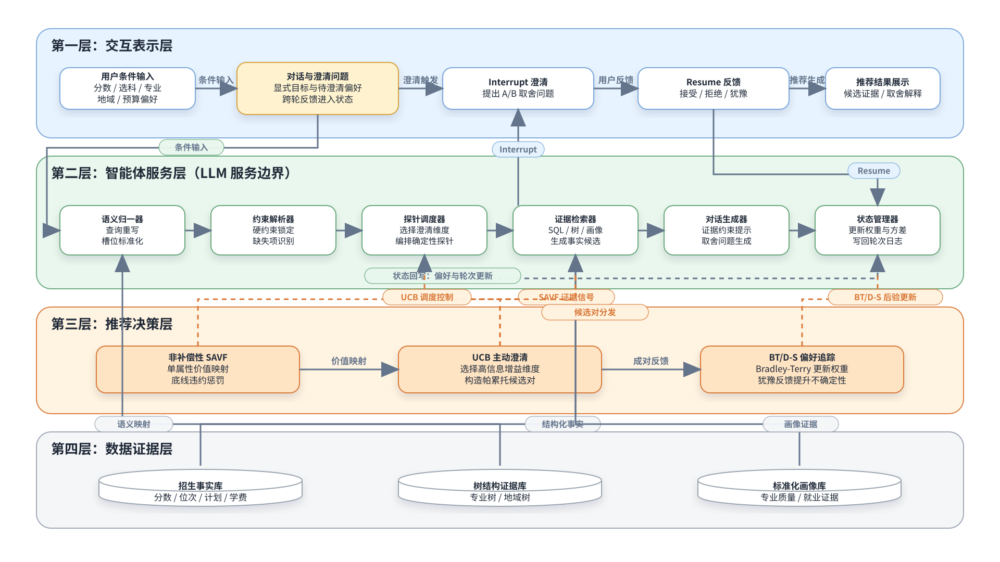
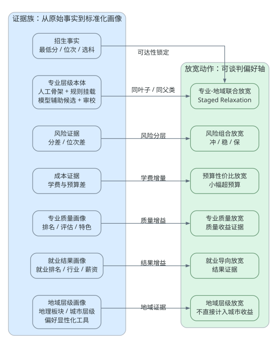
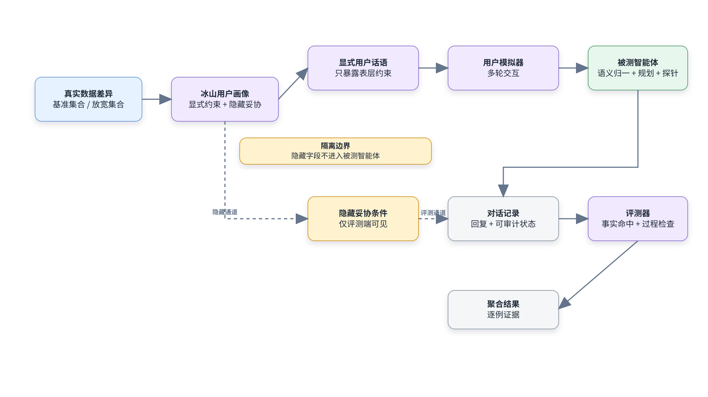
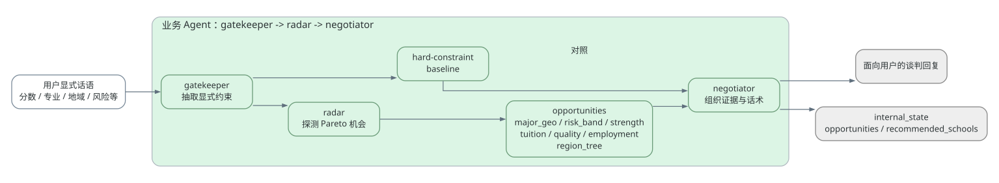

# 毕业论文连续正文总稿 v1

本文档是面向最终毕业论文成稿的连续阅读版草稿。它把现有章节母版、系统架构图、七组实验指标和逐例证据入口装配到同一条正文线索中，便于检查章节衔接、概念重复、图表位置、引用缺口和 LaTeX 迁移工作。

事实源仍以 `gaokaollm_bench/outputs/thesis_claims_manifest.json` 与 `gaokaollm_bench/outputs/thesis_document_hub.md` 为准。本文档不新增实验结论，不替代 summary、reports、transcripts 或 evidence 附录。

当前论文主线为：

```text
数据贡献 + Agent 贡献 + Benchmark 贡献
```

其中，v1 `gaokaollmmodel` 是第一版志愿咨询原型系统与问题发现来源；v2 是最终主贡献，由数据层、轻量 MAS / 多角色 Agent 与 Benchmark 闭环组成。被测 Agent 不读取 `implicit_flexibilities`、`volunteer_set` 或 `axis_flexibilities`，这些 hidden persona 字段只作为 simulator / evaluator 的 ground truth。

## 图表与证据入口

本文优先使用 `gaokaollm_bench/outputs/thesis_figures/` 中的 SVG/PNG 论文框图：

| 图号 | 图题 | 文件 |
| --- | --- | --- |
| 图 4-1 | 数据 + Agent + Benchmark 总体架构图 | `thesis_figures/fig_4_1_system_architecture.svg` |
| 图 4-2 | Benchmark 多轮评测流程图 | `thesis_figures/fig_4_2_benchmark_flow.svg` |
| 图 4-3 | 数据证据层与放宽能力映射图 | `thesis_figures/fig_4_3_data_evidence_relax_mapping.svg` |
| 图 5-1 | 轻量 MAS / 多角色 Agent 工作流图 | `thesis_figures/fig_5_1_mas_workflow.svg` |

主要证据附录：

| 证据文档 | 覆盖范围 |
| --- | --- |
| `agent_benchmark_major_geo_v1_evidence.md` | `major_geo_v1` 主实验逐例证据 |
| `agent_benchmark_risk_band_v1_evidence.md` | `risk_band_v1` 主实验逐例证据 |
| `thesis_data_agent_benchmark_extension_evidence.md` | `school_strength_v1`、`tuition_value_v1`、`major_quality_v1`、`employment_outcome_v1` |
| `agent_benchmark_region_tree_v1_evidence.md` | `region_tree_v1` 地域层级扩展实验逐例证据 |
| `agent_benchmark_multi_axis_v2_evidence.md` | `multi_axis_v2` 多轴 Benchmark 压力测试修正版逐例证据 |

## 第 1 章 绪论

### 1.1 研究背景

高考志愿填报是典型的高风险决策场景。考生和家庭需要同时权衡分数、位次、专业兴趣、地域偏好、学费预算、学校层次、就业预期和风险承受能力。传统问答式咨询系统能够解释政策或检索招生信息，但在真实志愿决策中，用户往往并不会一次性暴露全部偏好：他们可能显式表达“只想留在省内”“不要冲”“学费不要太贵”，同时又隐含着“如果证据充分，可以接受相邻专业、外省更好学校、冲稳保组合或小幅加价”的弹性空间。

大语言模型为志愿咨询提供了自然语言交互能力，但也带来两个关键风险。第一，模型可能在缺少真实招生数据支撑时产生幻觉；第二，模型即使能回答问题，也未必能在多轮对话中发现用户的隐性妥协空间。因此，本研究不把问题定义为单轮问答，而是定义为真实招生数据约束下的多轮偏好启发与 Pareto 谈判问题。

### 1.2 问题定义

本文关注的问题是：在不突破考生显式硬约束的前提下，Agent 能否基于真实招生数据和标准化证据层，主动发现可谈判偏好轴，并通过可审计证据触发用户隐藏妥协，从而得到相较硬约束基线更优的志愿候选。

本文中的硬约束主要包括分数、位次、选科、批次等事实边界；可谈判偏好包括专业、地域、风险组合、学费预算、专业质量、就业结果和地域层级证据等。Agent 的输出必须能够落到最低分、最低位次、学费、专业质量、就业结果或地域层级证据，而不能依赖模型主观断言。

### 1.3 研究挑战

第一，显性红线与隐性妥协并存。用户说“只看浙江”或“只求稳”时，系统不能直接忽略该要求，但也需要在证据充分时探索是否存在合理放宽空间。

第二，事实正确性要求高。志愿推荐不能只给出“学校更好”“城市更好”这类泛化表达，而应给出录取最低分、最低位次、学校层次、专业质量、就业结果或地域层级证据。

第三，多轮过程需要可评测。单轮 accuracy 不足以衡量 Agent 是否真正通过追问、解释和谈判触发偏好妥协，因此需要多轮沙盒、用户模拟器、被测 Agent 与评测器的闭环。

第四，论文结果需要可审计。每个成功 case 都应能回溯到对话记录、Agent 内部状态、候选证据和确定性裁判，而不是只保留聚合指标。

### 1.4 本文贡献

本文贡献分为三条主线。

数据贡献方面，本文构建并使用 PostgreSQL 招生事实快照，包括分数、位次、批次线、招生计划、学费、学校与专业维表；进一步构建专业层级本体、学校-专业质量画像、专业就业结果画像，以及经人工审校的地域层级画像。这些数据层为 Agent 输出和 Benchmark 裁判提供可核验依据。

Agent 贡献方面，本文设计轻量 MAS / 多角色 Agent 工作流：

```text
前置语义归一层 -> 约束解析器 -> LLM 引导的机会规划器 -> 确定性证据探针 -> 证据谈判器
```

前置语义归一层继承 v1 查询重写能力，只处理用户显式话语；约束解析器形成硬约束基线；LLM 引导的机会规划器负责探针计划、机会排序与澄清提示；确定性证据探针是学校、专业、分数、位次等事实候选的唯一来源；证据谈判器负责组织真实证据并生成可审计回复。

Benchmark 贡献方面，本文构建冰山画像、多轮沙盒、事实/过程联合评价和证据谈判 Agent vs 硬约束基线对照。用户画像中的 hidden fields 只用于用户模拟器和评测器，不进入被测 Agent 输入。

### 1.5 实验概述

本文当前采用七组实验口径。主实验为 `major_geo_v1 + risk_band_v1`；扩展实验为 `school_strength_v1`、`tuition_value_v1`、`major_quality_v1`、`employment_outcome_v1`、`region_tree_v1`。扩展实验用于说明数据证据维度与 Agent/Benchmark 框架的可扩展性，不替代主实验。

七组实验聚合结果见第 6 章。需要强调的是，`major_geo_v1` 不是 100% 成功，失败样本为 `real-db-set-浙江-569-009`，论文中必须保留该失败样本，避免把 `0.900` 写成完全成功。

### 1.6 论文结构

第 1 章介绍研究背景、问题定义和本文贡献。第 2 章综述 RAG、Agent、轻量 MAS、多轮 Benchmark、LLM-as-a-Judge、层级放宽与 Pareto 妥协相关技术。第 3 章介绍 v1 志愿咨询原型系统，并说明其如何引出 v2 的可评测闭环。第 4 章介绍 v2 的数据层与 Benchmark 构建。第 5 章介绍证据驱动 Pareto 谈判 Agent 与各类放宽算法。第 6 章给出主实验、扩展实验与逐例证据分析。第 7 章总结全文并讨论局限性与后续工作。

## 第 2 章 相关技术

### 2.1 RAG 与高考志愿问答系统

RAG 通过检索外部知识增强语言模型回答能力，适合政策解释、院校简介、专业介绍等知识密集型任务。高考志愿咨询中的 RAG 系统通常需要结构化招生事实和文本知识库并存：前者用于判断录取可达性、学费、位次等硬事实，后者用于解释学校和专业背景。

本文的 v1 原型采用 Agentic RAG 思路，证明了面向志愿咨询的工程系统可以整合意图识别、用户画像、混合检索、重排和流式响应。但 v1 主要解决“能回答”和“能推荐”的工程可用性问题，尚未形成对隐性妥协、Pareto gain 和逐例证据的严格评测。因此，v2 将重点转向数据驱动 Agent 与 Benchmark 闭环。

### 2.2 Agent 与轻量 MAS

多 Agent 系统强调角色分工、协作和信息流。本文不把业务 Agent 夸大为完全自治多智能体群体，而是采用轻量 MAS / 多角色 Agent 表述，将被测业务 Agent 拆分为语义归一、约束解析、机会规划、确定性探针和证据谈判五个职责明确的环节。

这种角色化设计的优势是可解释和可审计。前置语义归一层对应用户显式话语的重写和偏好轴拆解；约束解析器对应硬约束抽取；LLM 引导的机会规划器对应探针计划和解释顺序；确定性证据探针对应数据库查询和候选证据；证据谈判器对应自然语言解释和谈判回复。用户模拟器与评测器属于 Benchmark 侧 agent-like role，不写成被测业务 Agent 的内部能力。

### 2.3 数据证据标准化

高考志愿推荐中的“更好”必须被证据化。本文将数据证据分为招生事实、专业层级本体、学费、专业质量、就业结果和地域层级证据六类。

招生事实包括录取分数、最低位次、批次线、招生计划、选科约束、学费、学校和专业维表等。专业层级本体将原始专业名组织为可解释的层级放宽空间。学校-专业质量画像聚合专业排名、学科评估、特色专业、重点专业和满意度等证据。专业就业结果画像标准化就业排名、行业、地区、岗位和薪资等证据。经人工审校的地域层级画像表达地理板块和城市层级。

地域层级证据需要特别保持边界：城市层级只是引导偏好显性化的决策证据，不直接等价于就业机会、生活成本或城市生活质量收益；地域层级实验的 Pareto gain 仍按学校层次或排名改善计算。

### 2.4 多轮 Benchmark 与冰山画像

冰山画像将用户偏好分为显性约束和隐藏弹性。显性部分进入用户模拟器对话，hidden fields 只作为评测器 ground truth。本文通过多轮沙盒连接用户模拟器、被测 Agent 和评测器，记录完整对话，并在确定性事实裁判中检查学校命中、分数证据和具体 opportunity 证据。

这种设计使得“触发隐藏妥协”成为可评测对象。例如，风险偏好放宽画像中，用户显性说“只求稳”，隐藏条件是“如果给出真实最低分/位次和冲稳保组合证据，可以接受适度冲刺”。Agent 若只给出保守结果，即使事实正确，也不能算作成功触发妥协。

### 2.5 Pareto 妥协与层级放宽

本文将 Pareto 妥协理解为：在不破坏硬约束的前提下，通过放宽一个或多个可谈判偏好轴，使候选集合在学校层次、风险结构、专业质量、就业结果或其他证据维度上获得改善。专业层级本体和地域层级画像为这种放宽提供了可解释路径。

专业层级本体支撑专业-地域联合放宽的 staged relaxation：同叶子/近邻专业、同父类、相关大类或模型候选邻居，直至必要时进入更宽专业范围。地域层级画像支撑地理板块放宽与城市层级放宽，但仍需要在线澄清用户更在意距离近还是城市资源。

## 第 3 章 第一版志愿咨询原型系统与问题诊断

### 3.1 v1 系统概述

v1 `gaokaollmmodel` 是面向高考志愿咨询的 Agentic RAG 工程原型。它包含 LangGraph / 状态机工作流、意图识别、Redis 用户画像、混合检索、BGE-M3 / BCEmbedding 重排、`1:3:9` 冲稳保推荐、SSE 流式响应和神经-符号一致性校验等能力。

该系统的意义在于证明高考志愿咨询可以从静态问答走向多轮、画像化、检索增强和工程可用的交互式系统。它为后续 v2 提供了工程经验，也暴露了研究问题。

### 3.2 v1 的能力边界

v1 能够回答志愿相关问题并生成推荐，但它缺少对隐性妥协和动态放宽的严格验证。比如 `1:3:9` 冲稳保推荐是一种工程策略，能够组织风险梯度，但并未在 Benchmark 中验证“用户原本只求稳，是否会在证据充分时接受冲稳保组合”。

此外，v1 关注系统可用性与响应体验，尚未把每个推荐结果落到可复现对话、确定性裁判、逐例证据和聚合指标上。因此，如果直接把 v1 写成最终主贡献，论文会偏工程实现而缺少研究评测闭环。

### 3.3 从 v1 到 v2 的演进

v2 并不是推翻 v1，而是将 v1 的工程能力收敛到可评测的研究问题：如何基于真实招生数据和标准化证据层，设计一个能发现 Pareto opportunities 的 Agent，并用 Benchmark 验证它是否优于硬约束基线。

| 维度 | v1 原型 | v2 最终主贡献 |
| --- | --- | --- |
| 系统目标 | 能回答、能检索、能推荐 | 能评测、能审计、能触发偏好妥协 |
| 数据基础 | RAG 知识与用户画像 | PostgreSQL 招生事实 + 标准化证据层 |
| Agent 形态 | Agentic RAG 工作流 | 前置语义归一层 -> 约束解析器 -> LLM 引导的机会规划器 -> 确定性证据探针 -> 证据谈判器 |
| 风险推荐 | `1:3:9` 冲稳保工程策略 | 风险组合放宽实验中的可评测升级 |
| 评测方式 | 工程调试与中期报告 | 冰山画像、多轮沙盒、事实/过程联合评价 |

七组证据谈判 Agent 实验结果全部属于 v2，不混入 v1 原型成果。

## 第 4 章 数据层构建与 Benchmark 设计

### 4.1 总体架构

图 4-1 展示本文系统总体架构。



整体系统由四层组成：数据层、轻量 MAS Agent 层、Benchmark 层和论文产物层。数据层提供可查询事实；Agent 层基于角色分工探测和组织 Pareto opportunities；Benchmark 层通过用户画像、用户模拟器、被测 Agent 与评测器评测多轮偏好妥协；产物层保留聚合结果、对话记录和逐例证据。

### 4.2 PostgreSQL 招生事实

PostgreSQL 快照承担事实基座作用。录取最低分、最低位次、批次线、招生计划、选科约束、学费、学校和专业维表等结构化信息，用于约束 candidate query 和 factual judge。Agent 不能凭语言模型猜测录取可达性，必须通过数据库结果支持推荐。

### 4.3 标准化证据层

本文在招生事实之上构建多类标准化证据层。专业层级本体将原始专业名组织为层级放宽空间，支撑专业-地域联合放宽。学费字段支撑预算性价比放宽。学校-专业质量画像支撑专业质量证据，专业就业结果画像支撑就业结果证据。经人工审校的地域层级画像支撑地理板块与城市层级证据。

图 4-3 展示数据证据层与放宽能力之间的映射。



### 4.4 专业层级本体与地域层级画像

专业层级本体是面向志愿决策的层级放宽本体，而不是普通专业目录。其构建流程包括人工本体骨架、PostgreSQL 原始专业名扫描、规则挂载、模型候选、LLM / 人工审校和最终本体合成。现有统计包括 82 个节点、8 个 Level 0 大类、22 个 Level 1 节点、52 个叶子簇。后续全量覆盖版本进一步将原始去重专业名全部挂载到叶子簇，并保留来源、置信度和复核标记。

地域层级画像由地理邻近层级和城市层级两类证据组成。前者表达全国、大区/地理板块、省份、城市/都市圈等地理邻近关系；后者表达一线、新一线、强省会、普通省会、地级市等城市层级。地域层级画像通过自动挂载、HITL 审校包和覆盖报告形成可审计数据层。

### 4.5 Benchmark 流程

图 4-2 展示 Benchmark 多轮评测流程。



Benchmark 输入为冰山画像，其中显性画像用于用户模拟器生成用户话语，hidden fields 只用于评测器判断是否触发隐藏妥协。沙盒连接用户模拟器与被测 Agent，保存完整对话。确定性事实裁判检查学校命中、分数证据和具体 opportunity 证据；过程裁判检查谈判过程质量。

### 4.6 Target Agents

本文主要比较证据谈判 Agent 与硬约束基线。硬约束基线只按用户显式约束返回结果，不主动提出放宽谈判。证据谈判 Agent 则通过“前置语义归一层 -> 约束解析器 -> LLM 引导的机会规划器 -> 确定性证据探针 -> 证据谈判器”探测并组织证据，尝试触发隐藏偏好弹性。

## 第 5 章 证据驱动 Pareto 谈判 Agent 设计

### 5.1 轻量 MAS 工作流

图 5-1 展示业务 Agent 内部的角色化工作流。



前置语义归一层从用户显式话语中进行查询重写、偏好轴拆解、歧义提示和查询压缩。约束解析器抽取分数、省份、专业、选科、预算和风险偏好等显式约束，并形成硬约束基线。LLM 引导的机会规划器负责输出探针计划、机会排序和澄清提示。确定性证据探针调用结构化查询和标准化证据层，生成可审计候选。证据谈判器将候选组织成自然语言回复，解释为什么某些放宽不会突破硬约束，并给出最低分、最低位次或其他证据。

LLM 不生成学校、专业、最低分、最低位次等事实候选；这些候选只能来自确定性证据探针。业务 Agent 也不读取 `implicit_flexibilities`、`volunteer_set` 或 `axis_flexibilities`。

### 5.2 通用 Pareto Opportunity Detection

通用流程如下：

```text
Input: user utterances, explicit constraints, PostgreSQL evidence tables
1. Normalize explicit user utterances and split negotiable preference axes.
2. Extract hard constraints and build the hard-constraint baseline.
3. Ask the LLM-guided planner for probe_plan, opportunity_rankings, and clarification_hint.
4. Run deterministic probes over supported relaxation types.
5. Filter candidates by hard constraints and factual evidence.
6. Rank candidates by Pareto gain and evidence quality.
7. Send evidence-backed opportunities to the evidence negotiator.
Output: auditable negotiation response and candidate evidence state
```

该流程强调两个边界：第一，硬约束不被擅自突破；第二，hidden persona 不进入 Agent 输入。

### 5.3 专业-地域联合放宽

专业-地域联合放宽同时处理专业与地域偏好。专业放宽依赖专业层级本体的 staged relaxation，从同叶子/近邻专业开始，逐步扩展到同父类、相关大类或模型候选邻居；地域放宽基于真实可达候选和学校层次证据。`major_geo_v1` 中 `real-db-set-浙江-569-009` 失败说明，放宽阶段选择本身也是可评估对象。

### 5.4 风险组合放宽

风险组合放宽将志愿质量从单一“稳妥”扩展为 `chong/wen/bao` 风险组合。算法优先使用 `score_margin` 与 `rank_gap` 判断风险层级，rank 数据不足时 fallback 到 score margin。该能力对应 v1 `1:3:9` 冲稳保策略的可评测升级。

### 5.5 数据扩展类放宽

学校实力放宽使用较粗粒度学校/学科实力证据。学费预算放宽使用预算窗口，在小幅增加学费时寻找学校层次或排名收益。专业质量放宽使用专业质量分与质量增益。就业结果放宽使用就业结果分与就业排名、行业、岗位、薪资等标准化证据。

### 5.6 地域层级放宽

地域层级放宽使用经人工审校的地域层级画像，在显式地域偏好下探测地理板块放宽与城市层级放宽。候选需要包含学校、省份、城市、专业、最低分、最低位次、源地域节点、目标地域节点、放宽策略和树置信度。城市层级只作为地域层级证据，不直接等价于就业机会、生活成本或城市生活质量收益。

## 第 6 章 实验结果、逐例证据与分析

### 6.1 实验设置

本文实验统一使用冰山画像、多轮沙盒、证据谈判 Agent vs 硬约束基线对照和 offline deterministic judge。七组实验中，`major_geo_v1` 与 `risk_band_v1` 是主实验；其余五组是扩展实验，用于证明不同数据证据维度可以接入同一 Agent+Benchmark 闭环。

### 6.2 七实验结果总表

斜杠格式依次为：

```text
elicitation_success_rate / mean_pareto_gain / mean_hallucination_rate / avg_turns
```

| 实验 | 定位 | 机会类型 | 证据谈判 Agent | 硬约束基线 |
| --- | --- | --- | --- | --- |
| `major_geo_v1` | 主实验 | `major_geo_relax` | `0.900 / 0.900 / 0.000 / 5.20` | `0.000 / 0.000 / 0.000 / 7.00` |
| `risk_band_v1` | 主实验 | `risk_band_relax` | `1.000 / 3.000 / 0.000 / 5.00` | `0.000 / 0.000 / 0.000 / 15.00` |
| `school_strength_v1` | 扩展实验 | `strength_relax` | `1.000 / 15.000 / 0.000 / 5.00` | `0.000 / 0.000 / 0.000 / 11.00` |
| `tuition_value_v1` | 扩展实验 | `tuition_value_relax` | `1.000 / 1.000 / 0.000 / 5.00` | `0.000 / 0.000 / 0.000 / 11.00` |
| `major_quality_v1` | 扩展实验 | `major_quality_relax` | `1.000 / 16.000 / 0.000 / 5.00` | `0.000 / 0.000 / 0.050 / 11.00` |
| `employment_outcome_v1` | 扩展实验 | `employment_outcome_relax` | `1.000 / 49.000 / 0.000 / 3.00` | `0.000 / 0.000 / 0.000 / 11.00` |
| `region_tree_v1` | 扩展实验 | `region_tree_relax` | `1.000 / 1.000 / 0.000 / 3.00` | `0.000 / 0.000 / 0.000 / 11.00` |

### 6.3 主实验分析

`major_geo_v1` 验证专业+地域联合放宽能力。证据谈判 Agent 成功率为 `0.900`，平均 Pareto gain 为 `0.900`，幻觉率为 `0.000`，平均轮次为 `5.20`；硬约束基线成功率为 `0.000`。该结果说明，在真实招生事实和专业层级本体支撑下，Agent 能够在多数 case 中发现比硬约束基线更优的候选，并用证据触发隐藏妥协。失败样本 `real-db-set-浙江-569-009` 表明，放宽路径、候选可达性和证据命中仍需要逐例分析。

`risk_band_v1` 验证风险组合谈判能力。证据谈判 Agent 达到 `1.000 / 3.000 / 0.000 / 5.00`，而硬约束基线为 `0.000 / 0.000 / 0.000 / 15.00`。这说明“组合质量”也是 Pareto gain，不应只看单个学校层次。

### 6.4 扩展实验分析

`school_strength_v1`、`tuition_value_v1`、`major_quality_v1`、`employment_outcome_v1`、`region_tree_v1` 共同说明，本文框架可以把新的标准化数据证据接入同一套 Agent+Benchmark 闭环。扩展实验不替代主实验，而是支撑数据贡献和框架可扩展性。

其中，`major_quality_v1` 说明专业级质量证据比粗粒度学校实力更适合解释“同专业更强”的推荐；`employment_outcome_v1` 说明就业结果证据可以转化为 outcome gain；`region_tree_v1` 说明经人工审校的地域层级画像可以进入最小 Agent+Benchmark 闭环，但城市层级不能被直接写成城市收益。

### 6.5 Benchmark 压力测试：多轴隐藏妥协

在七组实验之外，本文保留多轴 Benchmark 压力测试，用于检验用户同时在两个方面存在隐藏妥协时，Agent 是否能同时发现并解释多类 Pareto opportunities。该压力测试不进入七组实验主表，也不替代 `major_geo_v1 + risk_band_v1` 主实验。

| 压力测试 | 定位 | 证据谈判 Agent | 硬约束基线 | profile 成功分布 | 结论 |
| --- | --- | ---: | ---: | --- | --- |
| `multi_axis_v1` | 历史压力测试版本 | `0.533 / 1.133 / 0.029 / 7.67` | `0.000 / 0.000 / 0.000 / 13.00` | `major_geo_risk` 1/10；`quality_tuition` 5/10；`employment_region` 10/10 | 暴露单轴实验看不出的多轴证据编排问题，但部分画像存在轴一致性不足 |
| `multi_axis_v2` | 轴一致性修正版 | `0.367 / 1.133 / 0.005 / 9.33` | `0.000 / 0.000 / 0.008 / 13.00` | `major_geo_risk` 6/10；`quality_tuition` 5/10；`employment_region` 0/10 | 修正两个轴围绕一致显性需求或可解释正交需求构造；`employment_region` 暴露就业证据与地域层级证据联合编排瓶颈 |

`multi_axis_v2` 仍只组合已有放宽能力，不新增业务放宽算法。压力测试中的 `axis_flexibilities` 只作为用户模拟器 / 评测器 ground truth，Agent 不读取该字段。

### 6.6 逐例证据与可复现性

本文的聚合结果均有逐例 evidence 支撑。主实验 evidence 分别记录了每个 case 的成功状态、turns、hallucination、pareto_gain 和候选证据。扩展 evidence 记录了专业实力、学费、专业质量、就业结果和地域层级候选。论文正文建议展示少量代表 case，完整逐例证据放入附录或答辩备查材料。

## 第 7 章 总结与展望

### 7.1 全文总结

本文从 v1 Agentic RAG 工程原型出发，最终形成了 v2 的数据 + Agent + Benchmark 三贡献闭环。v1 证明了高考志愿咨询可以通过 Agentic RAG、状态机、用户画像、混合检索和流式响应实现工程可用；v2 则进一步将问题收敛为可评测、可审计、可逐例追溯的偏好妥协任务。

数据贡献方面，本文不仅使用 PostgreSQL 招生事实，还构建了专业层级本体、学校-专业质量画像、专业就业结果画像和经人工审校的地域层级画像。Agent 贡献方面，本文采用“前置语义归一层 -> 约束解析器 -> LLM 引导的机会规划器 -> 确定性证据探针 -> 证据谈判器”轻量 MAS / 多角色 Agent 结构，实现证据驱动 Pareto 谈判。Benchmark 贡献方面，本文通过冰山画像、多轮沙盒、事实/过程联合评价和 Agent-vs-Baseline 对照，使“触发隐藏妥协”成为可复现实验对象。

### 7.2 主要结论

第一，硬约束基线虽然保守，但无法主动发现隐藏偏好弹性。七组实验中硬约束基线的成功率均为 `0.000`。

第二，基于真实数据和标准化证据层的 Agent 能够在主实验中显著优于基线。`major_geo_v1` 与 `risk_band_v1` 分别验证了专业+地域联合放宽和风险组合谈判。

第三，数据证据层具有可扩展性。学费、专业质量、就业结果和地域层级证据都可以接入同一 Agent+Benchmark 框架。

### 7.3 局限性

本文实验样本规模仍有限，每组实验以 10 个 case 为主。当前 judge 主要采用 offline deterministic 规则，虽然可复现和可审计，但对真实用户心理、解释偏好和长期满意度的建模仍较简化。地域层级证据不能直接代表就业机会、生活成本或生活质量。当前数据主要基于浙江 PostgreSQL 快照，多省份、多年份泛化仍需进一步验证。

### 7.4 后续工作

后续工作可以从四个方向展开。第一，补充真实用户校准，验证用户模拟器中的隐藏偏好弹性与真实考生偏好之间的对应关系。第二，继续增强城市收益指标，但必须建立可核验数据证据，不能只依赖学校城市字段或城市层级。第三，引入概率化录取风险模型，使风险层级从确定性分层走向可校准概率。第四，将当前框架迁移到更多省份和年份，验证数据层、Agent 和 Benchmark 的泛化能力。

## 待补项

- 正式 BibTeX：将相关技术中的 RAG、Agent、MAS、LLM-as-a-Judge、教育推荐和高考志愿研究补齐为正式文献。
- 三线表：将第 6 章实验表和方法映射表迁移为浙江大学模板适配的三线表。
- 图表格式：优先使用 `thesis_figures/` 下 SVG/PNG；若模板不兼容，再转为 PDF、PNG 或重绘。
- 章节润色：后续需要压缩重复概念、补充章节过渡段，并将本 Markdown 总稿迁入正式 LaTeX 模板。
- 证据附录：正式论文正文只保留代表 case，完整逐例 evidence 放入附录或答辩备查材料。
